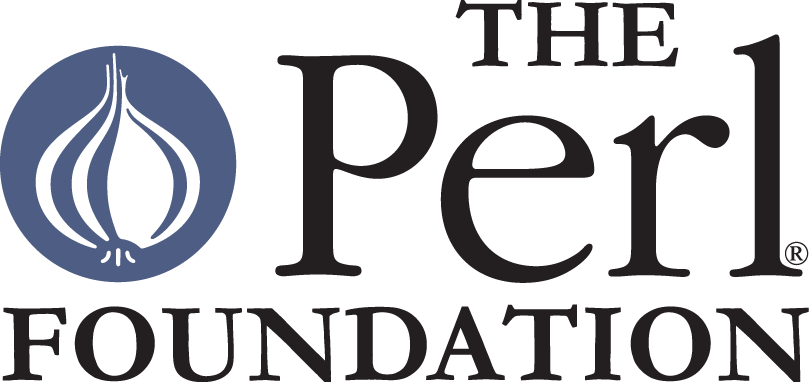

# Perl 6 documentation: Season of Doc ideas

This is a repository with ideas
about [Perl 6 documentation](https://docs.perl6.org) for [Google Season of Docs](https://developers.google.com/season-of-docs/). These must be focused on a single
project, and in principle there will be a single mentor for the chosen
persons of persons.

JJ Merelo is already the main contributor
to [Perl 6 documentation](https://github.com/perl6/doc) and has been
contributing to it for around 18 months. However, initially the chosen
person will be working via pull requests, and there are many persons
with permission to review and merge those pull requests, so it is
going to be more of a distributed effort.

Two ideas have been proposed for this:

* [Bring documentation up-to-date with 6.d](docs.md)
* [Work on *big* issues on the repository](big.md).
* [Outstanding issues in the documentation repository](https://github.com/perl6/doc/issues). These
  issues include from errors and improvements, through the *big*
  issues indicated above, to tooling problems or improvements. They
  are well structured and labeled, so just generally addressing and
  eventually closing them would be a nice improvement to the Perl 6
  documentation. During season of docs one or
  several
  [Squashathon](https://github.com/perl6/doc/blob/master/writing-docs/SQUASHATHONS.md)s
  devoted to documentation will take place. The person would be
  expected to help organize them, as well as work and collaborate with them.

